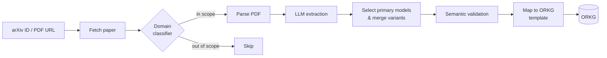

<div align="center">
  
</div>

<div align="center">

[](https://www.python.org/downloads/)
[](https://opensource.org/licenses/MIT)
[](https://orkg.org/templates/R609825)
[](https://orkg.org/comparisons/R1364660)

</div>

<h3 align="center">LLM Atlas: Automated Knowledge Extraction for a Large-Scale Catalog of Generative AI Models</h3>

**LLM Atlas** is an end-to-end pipeline that keeps a structured, machine-readable catalog of Large Language Models (LLMs) and Vision-Language Models (VLMs) up to date. It reads model papers from arXiv, extracts their key properties with an LLM, including parameters, architecture, training data, organisation, release date and license, and publishes the results as papers and contributions in the [Open Research Knowledge Graph (ORKG)](https://orkg.org/), structured by the ORKG LLM template. The project grows the ORKG comparison [*A Catalog of Transformer Models*](https://orkg.org/comparisons/R1364660). Adding new contributions to a comparison is a separate step you turn on yourself (`orkg.update_comparison`, off by default).

Generative AI models are released faster than anyone can catalog them by hand. LLM Atlas automates the work in one repeatable flow: **discover → classify → parse → extract → normalise → validate → map → upload**. 

## ✨ Highlights

- **End-to-end automation**: one command takes an arXiv ID or PDF URL all the way to an ORKG contribution.
- **Quarterly catalog runs**: a resumable runner processes a curated paper list per quarter (2020-Q1 → 2026-Q2) and keeps a full ledger of every outcome.
- **Domain classification**: papers are screened on title and abstract before the costly PDF parsing, so out-of-scope work is filtered early.
- **Multi-model extraction**: a single paper can produce several model entries. Size variants (e.g. 7B / 13B / 70B) are merged into one entry, and baselines and auxiliary artefacts are dropped.
- **Normalisation & semantic validation**: dates, organisations and parameter counts are converted to canonical forms. Entity-like values such as organisation, license, optimizer and pre-training corpus are checked against their ORKG property descriptions before upload. Free-text fields such as innovations and benchmark results are not validated.
- **ORKG-native output**: results are mapped to the ORKG LLM template [R609825](https://orkg.org/templates/R609825) and uploaded with duplicate detection. Uploads go to the sandbox by default.
- **Flexible inference backends**: the hosted [KISSKI Chat AI](https://chat-ai.academiccloud.de) API (OpenAI-compatible), or local GPU inference with Hugging Face Transformers on the GWDG Grete HPC cluster.
- **Rigorous evaluation**: strict match-based precision/recall/F1 for structured fields and BERTScore for free-text fields, measured against an ORKG-derived gold standard.
- **Optional fine-tuning**: a LoRA/QLoRA workflow for training a compact extraction model on the gold standard.

## ⚙️ How It Works



| Stage | Module |
|---|---|
| Fetch papers from arXiv (by ID, URL or search) | `src/paper_fetcher.py` |
| Classify papers as in or out of scope | `src/paper_classifier.py` |
| Extract text from PDFs | `src/pdf_parser.py` |
| Extract structured properties with an LLM | `src/llm_extractor.py`, `src/llm_extractor_transformers.py` |
| Normalise values to canonical formats | `src/extraction_normalizer.py` |
| Keep primary models, merge size variants, drop baselines | `src/model_contribution_selector.py`, `src/model_variant_merger.py`, `src/baseline_filter.py` |
| Validate values against ORKG property semantics | `src/value_rules.py`, `src/value_cache.py`, `src/semantic_validator.py` |
| Map to the ORKG template and upload | `src/template_mapper.py`, `src/orkg_client.py`, `src/orkg_manager.py` |
| Orchestrate the full flow | `src/pipeline.py` |

## 🧪 Installation

**Prerequisites**

- Python 3.9 or higher
- A [KISSKI Chat AI](https://chat-ai.academiccloud.de) API key (not needed for local GPU inference on Grete)
- An ORKG account on [sandbox.orkg.org](https://sandbox.orkg.org/) (for testing) and/or [orkg.org](https://orkg.org/) (for production)

**Setup**

```bash
git clone https://github.com/sciknoworg/llm-atlas.git
cd llm-atlas

python -m venv venv
source venv/bin/activate          # Windows: venv\Scripts\activate

pip install -r requirements.txt   # add requirements-dev.txt for testing and linting

cp .env.example .env              # Windows (PowerShell): Copy-Item .env.example .env
```

Then fill in your credentials in `.env`:

```env
# ORKG credentials
ORKG_EMAIL=your.email@example.com
ORKG_PASSWORD=your_password_here
ORKG_ENDPOINT_URL=https://sandbox.orkg.org/

# ORKG resource reuse whitelist (optional)
ORKG_RESOURCE_WHITELIST=your_orkg_resource_whitelist_here

# KISSKI Chat AI API (OpenAI-compatible)
KISSKI_API_KEY=your_kisski_api_key_here
KISSKI_API_KEY_2=your_second_kisski_api_key_here   # optional
KISSKI_API_KEY_3=your_third_kisski_api_key_here    # optional
# or a comma-separated list:
# KISSKI_API_KEYS=key_one,key_two,key_three
KISSKI_BASE_URL=https://chat-ai.academiccloud.de/v1
```

| Variable | Required | Description |
|---|---|---|
| `ORKG_EMAIL`, `ORKG_PASSWORD` | For uploads | ORKG account credentials |
| `ORKG_ENDPOINT_URL` | No | `https://sandbox.orkg.org/` for testing, `https://orkg.org/` for production |
| `ORKG_RESOURCE_WHITELIST` | No | Comma-separated ORKG user UUIDs whose existing resources may be reused instead of creating new ones. If the variable is not set, a built-in default list is used.|
| `KISSKI_API_KEY` | For API extraction | KISSKI Chat AI API key; not needed for GPU inference on Grete |
| `KISSKI_API_KEY_2`, `KISSKI_API_KEY_3`, … or `KISSKI_API_KEYS` | No | Additional keys pooled with the primary key. If a key hits its rate limit, the pipeline moves on to the next one |
| `KISSKI_BASE_URL` | No | KISSKI API base URL |

See [KISSKI_SETUP.md](KISSKI_SETUP.md) for how to obtain and configure an API key.

> [!IMPORTANT]
> Bulk-upload scripts (`scripts/quarterly.py run --upload`, `scripts/reupload_pending.py`) ignore `ORKG_ENDPOINT_URL` and always default to the **sandbox**. To write to the live ORKG, pass `--host production` explicitly.

Pipeline behaviour is configured in [`config/config.yaml`](config/config.yaml):

| Section | Key | Description |
|---|---|---|
| `orkg` | `host` | Fallback ORKG host (`sandbox`, `incubating`, `production`) when `ORKG_ENDPOINT_URL` is not set |
| `orkg` | `template_id` | ORKG LLM template (`R609825`) |
| `orkg` | `comparison_id` | Target comparison (sandbox `R2147679`, live `R1364660`) |
| `orkg` | `update_comparison` | Also add uploaded contributions to the target comparison (default `false`). Only unpublished comparisons can be updated |
| `kisski` | `model` | LLM used for extraction |
| `kisski` | `temperature` | `0.0` for deterministic extraction |
| `extraction` | `max_chunk_size` | Maximum characters per PDF chunk |
| `semantic_validation` | `enabled` | Toggle property-level value validation |
| `pipeline` | `extraction_output_dir` | Directory for intermediate extraction JSONs |

## 🚀 Quick Tour

### Process a single paper

Start with an extraction-only run. Nothing is written to ORKG, so you can inspect the result first:

```bash
python -m src.pipeline --arxiv-id 2302.13971 --no-update
```

The result is saved as `results/extracted/2302.13971_<timestamp>.json`. Once it looks right, upload it to the ORKG instance set in `ORKG_ENDPOINT_URL`. Make sure that points at the sandbox while you're testing:

```bash
python -m src.pipeline --json-file results/extracted/2302.13971_<timestamp>.json
```

Common variations:

```bash
# Extract and upload in one step
python -m src.pipeline --arxiv-id 2302.13971

# From a PDF URL instead of an arXiv ID
python -m src.pipeline --pdf-url https://example.org/paper.pdf --paper-title "Paper Title"

# Choose the extraction model and ORKG endpoint
python -m src.pipeline --arxiv-id 2302.13971 --model llama-3.3-70b-instruct \
    --orkg-endpoint-url https://sandbox.orkg.org/

# Search arXiv and process the top results
python -m src.pipeline --search "large language model" --max-results 5

# Evaluate against the gold standard after extraction (all | structured | bertscore)
python -m src.pipeline --arxiv-id 2302.13971 --evaluate all

# Check connections and pipeline status
python -m src.pipeline --test
python -m src.pipeline --status
```

### Python API

```python
from src.pipeline import ExtractionPipeline

pipeline = ExtractionPipeline()
result = pipeline.process_paper("2302.13971", update_orkg=False)  # extraction only

print(result["status"])           # "completed"
print(result["saved_path"])       # results/extracted/2302.13971_<timestamp>.json
print(result["extraction_data"])  # one entry per model
```

Example `extraction_data` for the LLaMA paper (trimmed):

```json
[
  {
    "model_name": "LLaMA",
    "model_family": "LLaMA",
    "organization": "Meta",
    "date_created": "2023-02-27",
    "parameters": "7B, 13B, 30B, 33B, 65B",
    "parameters_millions": 65000,
    "pretraining_architecture": "Decoder",
    "pretraining_task": "Next token prediction",
    "pretraining_corpus": "Common Crawl, C4, GitHub, Wikipedia, Gutenberg Project, Books3, ArXiv, StackExchange",
    "optimizer": "Adam",
    "tokenizer": "SentencePiece",
    "context_length": "2048",
    "source_code": "https://github.com/facebookresearch/llama"
  }
]
```

The paper's size variants (7B to 65B) are merged into a single entry. After an upload, `result["orkg_results"]` contains the ORKG paper ID and contribution IDs.

### Build the catalog quarter by quarter

[`scripts/quarterly.py`](scripts/quarterly.py) runs the full pipeline over each quarter's curated paper list. It writes a result after every paper, so a stopped run picks up where it left off.

```bash
python scripts/quarterly.py validate --check-arxiv          # pre-flight check of the paper lists
python scripts/quarterly.py run --quarter 2024-Q1           # extract one quarter, no upload
python scripts/quarterly.py run --all --upload              # extract everything, upload to the ORKG sandbox
python scripts/quarterly.py status                          # per-quarter progress
python scripts/quarterly.py recall -v                       # coverage against the gold standard
```

See [`scripts/README.md`](scripts/README.md) for every option and the other utility scripts.

## 📦 Discovery Dataset

The repository includes a curated **discovery dataset** of LLM/VLM papers covering **26 quarters, from 2020-Q1 to 2026-Q2**, together with the pipeline's extraction output for each paper:

```
data/discovery/
├── _index.json              # cross-quarter index of processed papers
├── processed_papers.csv     # ledger: one row per paper with models, ORKG IDs and status
└── <year>/Q<n>/
    ├── discovery.json       # the quarter's paper list
    └── extraction/          # one extraction JSON per paper
```

The prompt, service, selection criteria and run dates behind each list are documented in [`data/discovery/README.md`](data/discovery/README.md#provenance) and [`docs/discovery-prompt.md`](docs/discovery-prompt.md).

## 📊 Evaluation

Extraction quality is measured against a gold standard derived from the ORKG comparison [R1364660](https://orkg.org/comparisons/R1364660) (`data/gold_standard/gold_standard_set.json`).

```bash
python scripts/evaluation/evaluate_extraction_strict.py \
    --gold data/gold_standard/gold_standard_set.json \
    --prediction results/extracted/your_extraction.json \
    --output results/evaluation_report.json
```

| Field type | Examples | Metric |
|---|---|---|
| **Structured** | model name, parameters, release date, organisation | Match-based precision, recall and F1, with field-specific rules (date tolerance, organisation aliases, parameter-set F1) |
| **Semantic** | innovation, extension, application, research problem, pre-training corpus | [BERTScore](https://github.com/Tiiiger/bert_score) (RoBERTa-large), which credits paraphrases that exact matching would penalise |

To compare several extraction models, use `scripts/aggregate_model_evaluation.py` and `scripts/build_results_table.py`. Matching rules are documented in [`scripts/evaluation/README.md`](scripts/evaluation/README.md).

## 🖥️ HPC Inference & Fine-Tuning

To run large batches without API rate limits, run extraction on the **GWDG Grete** cluster with local GPU inference through Hugging Face Transformers:

```bash
sbatch grete/jobs/grete_extract_job.sh 2302.13971    # single paper
sbatch grete/jobs/grete_extract_batch.sh             # SLURM batch array
```

The [`finetuning/`](finetuning/README.md) module provides an optional LoRA/QLoRA workflow that trains a compact model (Llama-3.2-3B-Instruct) for the same extraction task and evaluates it against the base model.

## 🗂️ Project Structure

```
llm-atlas/
├── src/                          # Core pipeline: fetching, classification, parsing, extraction, validation, ORKG
├── scripts/                      # Quarterly runner, batch extraction, ORKG upload and evaluation utilities
│   └── evaluation/               # Gold-standard evaluators
├── grete/                        # GWDG Grete HPC inference
│   ├── extraction/               # GPU extraction scripts (Hugging Face Transformers)
│   └── jobs/                     # SLURM job scripts
├── finetuning/                   # Optional LoRA/QLoRA fine-tuning workflow
│   ├── dataset/                  # Train/validation/test splits (JSONL)
│   ├── jobs/                     # SLURM job scripts
│   └── results/                  # Fine-tuned model extractions and evaluation reports
├── config/
│   └── config.yaml               # Pipeline configuration
├── data/
│   ├── discovery/                # Quarterly discovery dataset and extraction results
│   ├── gold_standard/            # Gold-standard evaluation data and paper list
│   ├── extracted/                # Benchmark extractions, one folder per extraction model
│   ├── papers/                   # Downloaded PDFs (git-ignored) and paper metadata
│   ├── property_descriptions.json  # Cached ORKG property descriptions for semantic validation
│   ├── value_validation_cache.json # Cached semantic-validation verdicts
│   ├── orkg_template_R609825.json  # Snapshot of the ORKG LLM template
│   └── arxiv_monthly_volume.csv    # arXiv paper counts per month and category
├── results/                      # Aggregated model-comparison results table
├── docs/                         # Supplementary documentation
├── images/                       # README assets
├── tests/                        # Unit tests
├── .env.example                  # Environment variable template
├── KISSKI_SETUP.md               # KISSKI API setup guide
├── pyproject.toml                # Packaging and tool configuration
├── requirements.txt              # Runtime dependencies
└── requirements-dev.txt          # Development dependencies
```

## 📚 Documentation

| Guide | Covers |
|---|---|
| [`scripts/README.md`](scripts/README.md) | Every script and its options, including the quarterly runner and ORKG upload tools |
| [`scripts/evaluation/README.md`](scripts/evaluation/README.md) | Evaluation methodology and field-specific matching rules |
| [`data/discovery/README.md`](data/discovery/README.md) | Discovery dataset layout and provenance |
| [`data/gold_standard/README.md`](data/gold_standard/README.md) | Gold-standard dataset |
| [`grete/README.md`](grete/README.md) | Running extraction on the Grete HPC cluster |
| [`finetuning/README.md`](finetuning/README.md) | LoRA/QLoRA fine-tuning workflow |
| [`KISSKI_SETUP.md`](KISSKI_SETUP.md) | Obtaining and configuring KISSKI API access |

## 🧑‍💻 Development

```bash
pip install -r requirements-dev.txt
pytest tests/ -v
pytest tests/ -v --cov=src --cov-report=term-missing   # with coverage
```

## 👥 Contact & Contributions

Contributions are welcome. To report a bug or suggest a feature, please open an [issue](https://github.com/sciknoworg/llm-atlas/issues). To contribute code, make sure the test suite passes and open a pull request against `main`.

## 💡 Acknowledgements

- The [Open Research Knowledge Graph (ORKG)](https://orkg.org/) for the knowledge graph infrastructure
- [GWDG](https://gwdg.de/) for HPC resources on the Grete cluster and for KISSKI Chat AI API access
- [arXiv](https://arxiv.org/) for open access to its paper metadata and full texts

## 📃 License

This software is licensed under the [MIT License](LICENSE).
